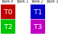

## Bank conflicts
CUDA threads can use a small amount of scratchpad "shared" memory, that is located on chip and
therefore has faster access times than the global GPU DRAM. This memory is accessed through multiple
memory banks, which allows multiple threads to access the shared memory in parallel.

Which bank is used for a given memory access is determined by the number of banks, size of each
bank and finally the memory address. For modern CUDA architectures, bank size is usually 4 bytes
(https://docs.nvidia.com/cuda/pascal-tuning-guide/index.html#shared-memory-bandwidth) and there are
32 banks, one for each thread in a warp. Banks are assigned to addresses sequentially, according to
this formula: `bank = (address / 4) % 32`. Therefore address `1024` goes to bank 0, `1028` goes to
bank 1 etc.

This means that if 32 threads access 32 4-byte shared memory locations at once, the access can
proceed completely in parallel if they use all 32 memory banks. However, if multiple threads use
the same memory bank, those accesses will be effectively serialized. This is called a bank conflict.
In the worst case, if all threads use the same memory bank, the memory accesses could take up to 32x
longer. There is however an exception to this when multiple threads read from the exact same
address (which implies that they use the same memory bank). In this case only one bank access will be
generated, the value will be broadcasted to all of the threads and the bank conflict will be avoided.

Usage:
```bash
$ bank-conflicts <offset>
```

The program will spawn exactly one warp of threads (32 threads in a single block). The threads will
then repeatedly read and write to shared memory at address starting at `threadIdx.x * offset`.
The address will then be incremented by `32 * 4`, which will not change the bank and is in the code
just to avoid the compiler from optimizating the accesses away.

Suppose that there are only 4 threads and 4 memory banks. With `offset=1`, the bank mapping will look
like this:


All threads get a separate bank and thus accesses to shared memory can proceed at full speed.

When we increase `offset` to 2:



Each threads shares a memory bank with another thread, which will slow down their accesses to shared
memory.

And finally when we set `offset` to the number of threads, i.e. `4` in this case:


Only one memory bank is used and thus accesses to shared memory will be fully serialized.

You should observe a slowdown when you start to increase the `offset`, up to `32`, the worst case.

Note that the slowdown is not caused by the fact that the accesses are not consecutive with
higher `offsets`, but by the bank conflicts. Even if you move each thread to a separate "row" to create
a jagged access shape (`index = threadId + 32 * threadId`), the runtime should react to the `offset`
changes in the same way, even though the accesses will no longer be consecutive.

If you use `offset=0`, all threads will access the same memory location, therefore broadcasting will
be used and there should be no bank conflicts. This will however produce undefined behaviour, as the
threads in the kernel also write and thus there will be data races.

You can get the number of shared memory bank conflicts using `nvprof`, using events
`shared_ld_bank_conflict` and `shared_st_bank_conflict` or metrics `shared_efficiency` and
`shared_load_transactions_per_request`.

Case with `offset=1`:
```bash
$ nvprof -e shared_ld_bank_conflict,shared_st_bank_conflict --metrics shared_efficiency,shared_load_transactions_per_request ./bank-conflicts 1
Invocations            Metric Name                       Min         Max         Avg
1000                   shared_ld_bank_conflict           0           0           0  
1000                   shared_st_bank_conflict           0           0           0  
1000                         shared_efficiency           95.74%      95.74%      95.74%
1000      shared_load_transactions_per_request           1.000000    1.000000    1.000000
```

We can see that in this case there are no bank conflicts, there is exactly one memory transaction per
each shared memory load access and the shared memory efficiency is quite high.

Case with `offset=32`:
```bash
$ nvprof -e shared_ld_bank_conflict,shared_st_bank_conflict --metrics shared_efficiency,shared_load_transactions_per_request ./bank-conflicts 32
Invocations            Metric Name                  Min         Max         Avg
1000                   shared_ld_bank_conflict      310000      310000      310000
1000                   shared_st_bank_conflict      310000      310000      310000
1000                         shared_efficiency      3.14%       3.14%       3.14%
1000      shared_load_transactions_per_request      32.000000   32.000000   32.000000
```

In this case there are 32 bank conflicts (and therefore 32 memory transactions) for each warp memory
access, and the shared memory efficiency is very low.

You can use the provided `benchmark.py` script to test various `offset` combinations
and plot their relative speeds.

```bash
$ python3 benchmark.py <path-to-executable>
```
